# Verial Services 🥝

Verial Services is a full-stack, multi-tenant services marketplace built for New Zealand. It connects local service providers with customers, handling bookings, payments, availability, and trust verification.

---

## 🛠️ Tech Stack

- **Framework:** Next.js 16 (App Router, Server Components)
- **Language:** TypeScript
- **Database:** Neon (serverless PostgreSQL)
- **ORM:** Drizzle ORM
- **Auth:** Clerk
- **Payments:** Stripe Connect (Express accounts)
- **Storage:** Cloudflare R2 (via AWS S3-compatible SDK)
- **UI:** shadcn/ui + Tailwind CSS v4
- **Forms & Validation:** React Hook Form, Zod
- **Email:** Resend
- **Monitoring:** Sentry

---

## 🚀 Getting Started

### 1. Prerequisites

- Node.js 18+
- pnpm (`npm install -g pnpm`)
- A Neon PostgreSQL database
- Accounts for Clerk, Stripe, Cloudflare R2, Resend, and Sentry

### 2. Installation

```bash
git clone https://github.com/thefishingvault-bot/verial-services.git
cd verial-services
pnpm install
```

### 3. Environment Setup

Create a `.env.local` at the project root and populate the required variables.

**Core application**

- `NEXT_PUBLIC_SITE_URL` – Public URL of the app (e.g. `http://localhost:3000` in dev, Vercel URL in prod)
- `CRON_KEY` – Shared secret for internal cron / admin endpoints

**Database (Neon / Drizzle)**

- `DATABASE_URL` – Neon Postgres connection string

**Clerk (Auth)**

- `NEXT_PUBLIC_CLERK_PUBLISHABLE_KEY`
- `CLERK_SECRET_KEY`

**Stripe (Core + Connect)**

- `NEXT_PUBLIC_STRIPE_PUBLISHABLE_KEY`
- `STRIPE_SECRET_KEY`
- `STRIPE_WEBHOOK_SECRET` – Core payments webhook
- `STRIPE_CONNECT_WEBHOOK_SECRET` – Connect account webhook

**Stripe Billing (Provider subscriptions)**

- `STRIPE_PRICE_PRO_MONTHLY` – Stripe Price ID for the Pro monthly plan
- `STRIPE_PRICE_ELITE_MONTHLY` – Stripe Price ID for the Elite monthly plan

**Cloudflare R2 (file uploads)**

- `R2_ACCESS_KEY_ID`
- `R2_SECRET_ACCESS_KEY`
- `R2_BUCKET`
- `R2_ACCOUNT_ID`
- `R2_PUBLIC_URL` – Public base URL for served assets

**Email (Resend)**

- `RESEND_API_KEY`
- `EMAIL_FROM` – Default from address for system emails

**Sentry (Monitoring)**

- `NEXT_PUBLIC_SENTRY_DSN`
- `SENTRY_DSN`
- `SENTRY_AUTH_TOKEN`

> Note: In production you should configure these via your Vercel project settings. For local development, keep them in `.env.local` which is git-ignored.

### 4. Database Setup

Push the Drizzle schema to your Neon database:

```bash
pnpm run drizzle:push
```

You can inspect and explore the schema with Drizzle Studio:

```bash
pnpm run drizzle:studio
```

### 5. Running Locally

```bash
pnpm dev
```

The app will be available at `http://localhost:3000`.

For Stripe webhooks in local development you can use the Stripe CLI:

```bash
stripe listen --forward-to localhost:3000/api/stripe/webhook
stripe listen --forward-connect-to localhost:3000/api/webhooks/stripe-connect
```

---

## 🧱 Architecture Overview

### High-Level

- **Next.js App Router** under `src/app` for both pages and API routes.
- **Drizzle ORM** models live in `src/db/schema.ts` and are used by route handlers and libs in `src/lib`.
- **Clerk** provides authentication (server helpers in API routes, client hooks in components).
- **Stripe Connect** manages payments and provider payouts via API routes under `src/app/api/stripe` and `src/app/api/webhooks`.
- **Cloudflare R2** stores user avatars and service images via signed upload URLs.
- **Sentry** instruments the app for error tracking.

### Database Schema (Simplified)

```mermaid
erDiagram
	users {
		varchar id PK
		varchar email
		text first_name
		text last_name
		text avatar_url
		user_role role
		varchar provider_id FK
	}

	providers {
		varchar id PK
		varchar user_id FK
		varchar handle
		varchar business_name
		text bio
		provider_status status
		boolean is_verified
		trust_level trust_level
		int trust_score
		varchar stripe_connect_id
		boolean charges_enabled
		boolean payouts_enabled
		boolean charges_gst
	}

	services {
		varchar id PK
		varchar provider_id FK
		varchar title
		varchar slug
		text description
		int price_in_cents
		service_category category
		text cover_image_url
		boolean charges_gst
	}

	bookings {
		varchar id PK
		varchar user_id FK
		varchar service_id FK
		varchar provider_id FK
		booking_status status
		timestamp scheduled_date
		int price_at_booking
		varchar payment_intent_id
	}

	reviews {
		varchar id PK
		varchar user_id FK
		varchar provider_id FK
		varchar booking_id FK
		int rating
		text comment
	}

	provider_availabilities {
		varchar id PK
		varchar provider_id FK
		day_of_week day_of_week
		time start_time
		time end_time
		boolean is_enabled
	}

	provider_time_offs {
		varchar id PK
		varchar provider_id FK
		text reason
		timestamptz start_time
		timestamptz end_time
	}

	notifications {
		varchar id PK
		varchar user_id FK
		text message
		text href
		boolean is_read
	}

	users ||--o| providers : "has one (optional)"
	users ||--o{ bookings : "creates"
	users ||--o{ reviews : "writes"
	users ||--o{ notifications : "receives"

	providers ||--|| users : "belongs to"
	providers ||--o{ services : "offers"
	providers ||--o{ bookings : "fulfills"
	providers ||--o{ reviews : "receives"
	providers ||--o{ provider_availabilities : "schedules"
	providers ||--o{ provider_time_offs : "blocks"

	services ||--|| providers : "owned by"
	services ||--o{ bookings : "booked via"

	bookings ||--|| users : "customer"
	bookings ||--|| services : "for service"
	bookings ||--|| providers : "with provider"
	bookings ||--o| reviews : "can have one"

	reviews ||--|| users : "by user"
	reviews ||--|| providers : "about provider"
	reviews ||--|| bookings : "for booking"

	notifications ||--|| users : "for user"
```



---

## 👥 User Roles

- **Customer**
	- Browse and search services
	- Book providers
	- Manage bookings and payments
	- Leave reviews after completion

- **Provider**
	- Complete onboarding and verification
	- Create and manage service listings
	- Configure availability and time off
	- View and act on booking requests
	- Receive payouts via Stripe Connect

- **Admin**
	- Review and approve provider applications
	- View fees and revenue reports
	- Run maintenance / trust-score recomputations

---

## 🔁 Key Workflows

### Provider Onboarding

1. User signs up / signs in via Clerk.
2. User navigates to `/dashboard/register-provider`.
3. Fills in business details (handle, name, bio) which creates a `providers` row.
4. Completes Stripe Connect onboarding to enable payouts.
5. Admin reviews and approves the provider in the admin dashboard.
6. Provider creates one or more services under `/dashboard/services`.

### Booking Lifecycle

1. Customer browses `/services` or a direct `/s/[slug]` page.
2. Customer selects a date; the system:
	 - Uses provider recurring schedule (`provider_availabilities`).
	 - Applies `provider_time_offs` to block days.
	 - Generates 30-minute slots in NZ time and returns them as ISO timestamps.
3. Customer selects a slot and submits a booking request (status: `pending`).
4. Provider reviews requests on `/dashboard/bookings/provider` and accepts or declines.
5. When accepted, customer proceeds to payment (Stripe) and booking can move to `paid` then `completed`.
6. After completion, customer can leave a review which updates the provider’s average rating and trust.
7. Notifications are sent (via `notifications` table and `/api/notifications` routes) for key events like new bookings, status changes, and reviews.

### Payments & Payouts (Stripe Connect)

- Each provider is linked to a Stripe Connect Express account (`stripeConnectId`).
- Customer payments are handled via Stripe Payment Intents.
- The platform takes a fee (e.g. 10%) and the remainder is sent to the provider’s Connect account.
- Webhooks update booking status and Stripe state via routes under `src/app/api/stripe` and `src/app/api/webhooks`.
- Providers can see payout-related info under `/dashboard/payouts`.

---

## 📂 Key Directories

- `src/app`
	- App Router pages for marketing, auth, and dashboards
	- API routes under `src/app/api` for bookings, providers, services, notifications, uploads, and Stripe
- `src/db`
	- `schema.ts` – Drizzle table and relation definitions
	- `migrations/` – SQL migrations generated by Drizzle Kit
- `src/lib`
	- `db.ts` – Drizzle database client
	- `stripe.ts` – Stripe client and helpers
	- `r2.ts` – Cloudflare R2 integration
	- `email.ts` – Resend email helpers
	- `notifications.ts` – notification helper utilities
	- `utils.ts` – formatting and shared helpers (e.g. `formatPrice`, trust badges)
- `src/components`
	- `ui/` – shadcn/ui primitives
	- `forms/`, `cards/`, `nav/`, etc. – application-specific components
	- `common/contact-button.tsx` – shared contact button used by multiple pages

---

## 📜 NPM / pnpm Scripts

- `pnpm dev` – Run the Next.js dev server at `http://localhost:3000`.
- `pnpm build` – Production build (`next build --webpack`).
- `pnpm start` – Start the production server.
- `pnpm lint` – Run ESLint.
- `pnpm typecheck` – Run TypeScript type checking.
- `pnpm drizzle:generate` – Generate Drizzle SQL migrations from the schema.
- `pnpm drizzle:push` – Push schema changes to the database.
- `pnpm drizzle:studio` – Open Drizzle Studio to inspect the database.

---

## 🚢 Deployment (Vercel)

1. Push your code to GitHub (or another Git provider).
2. Import the repository into Vercel.
3. Configure all environment variables in the Vercel project settings.
4. Set the production database URL (Neon) and production keys for Clerk, Stripe, R2, Resend, and Sentry.
5. Deploy the app.

### Post-Deployment Tasks

- Configure Stripe webhooks to point at your Vercel deployment URLs for:
	- Core payments: `/api/stripe/webhook`
	- Stripe Connect events: `/api/webhooks/stripe-connect`
- Optionally configure Vercel Cron Jobs for periodic tasks (e.g. trust-score recomputation endpoints under `/api/admin`).
- Verify Sentry is receiving events from production.

---

## 🧪 Notes for Contributors

- Run `pnpm typecheck` and `pnpm lint` before opening a PR.
- Use Drizzle migrations (`drizzle:generate` + `drizzle:push`) for any schema changes.
- Keep server-only logic in route handlers and server components; use client components only where needed for interactivity.

Verial Services is designed to be a pragmatic, production-ready foundation for a local services marketplace in New Zealand. Contributions that improve reliability, observability, and UX are especially welcome.
